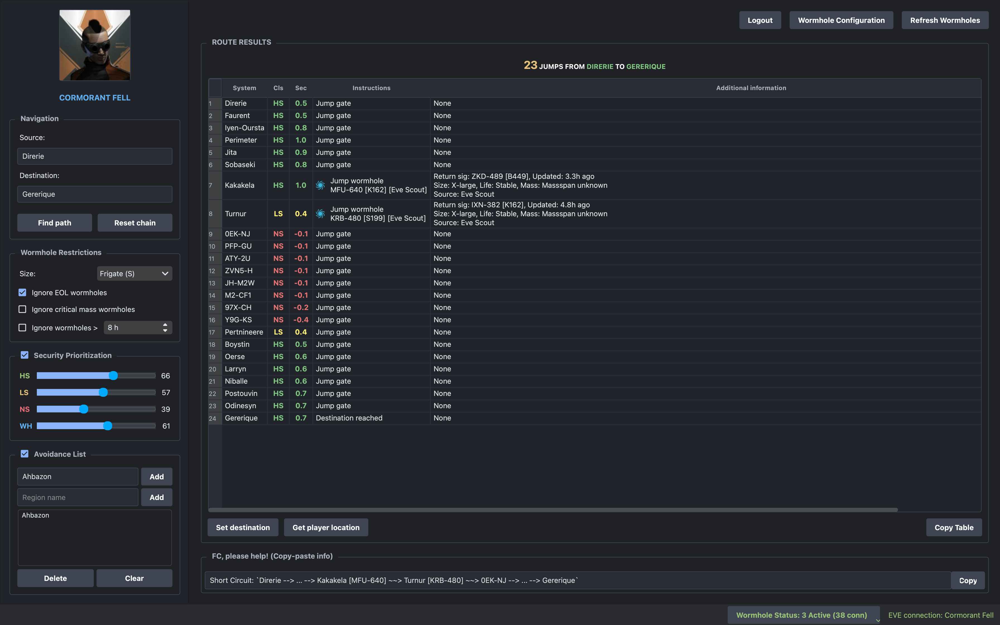
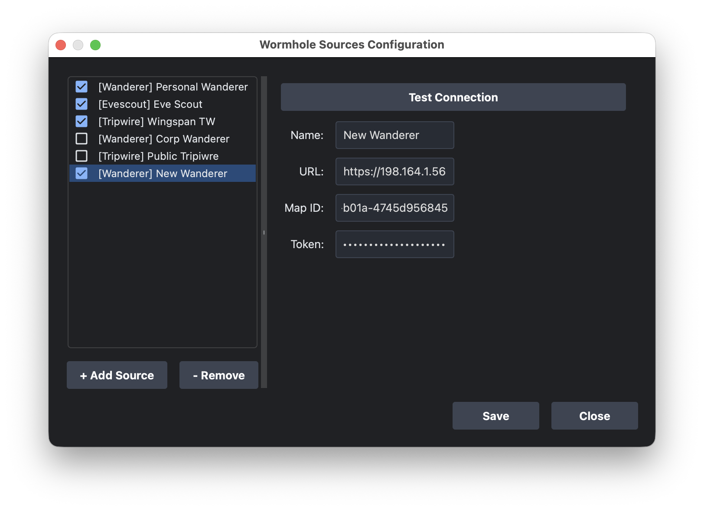

#### THIS IS A PERSONAL PROJECT, MAINLY TO INTEGRATE WITH WANDERER, IS CLEARLY NOT READY FOR PRIMETIME, AND LIKELY WILL NEVER BE! I highly encourage folks to continue with the excellent https://github.com/secondfry/shortcircuit

# Short Circuit

[](https://github.com/mogglemoss/shortcircuit/releases)
[](https://github.com/mogglemoss/shortcircuit/actions/workflows/appimage.yml)

 **Short Circuit** is an advanced, standalone routing and navigation tool for EVE Online. It calculates the absolute shortest path between solar systems by seamlessly blending standard Stargate routes with live wormhole connections pulled from your favorite 3rd-party mapping tools.

Whether you're running logistics, hunting targets, or just daytripping in J-Space, Short Circuit takes the guesswork out of traversing New Eden.

## ✨ Features


* **Intelligent Hybrid Routing**: Calculate optimized paths across High Sec, Low Sec, Null Sec, and Wormhole space in seconds.
* **EVE SSO Integration**: Log in securely with your EVE Online account to automatically fetch your current in-game location and set route waypoints directly in the game client.
* **Granular Route Filtering**:
  * **Wormhole Restrictions**: Filter potential paths by ship size (e.g., Frigate, Cruiser), and choose to ignore End of Life (EOL) holes, critical mass holes, or wormholes older than a specified time limit.
  * **Security Prioritization**: Fine-tune your route using custom sliders (1-100) to weight your preference for High Sec, Low Sec, Null Sec, or WH space.
  * **Avoidance List**: Blacklist specific solar systems or entire regions to keep your route out of known gate camps and dangerous space.
* **Fleet-Friendly Exporting**: 
  * Copy your route in a simplified text format perfect for fleet chat (`Jita --> ... --> Iyen-Oursta [HVE-768] ~~> J153528`).
  * Copy the full, detailed instruction table with a single click.

## 📡 Enhanced Integrations (v2.1.0)

* **Multi-Source Aggregation**: Simultaneously connect to multiple mapping tools. Aggregate data from your corp's Tripwire, and your personal Wanderer map all at once.
* **Multi-Account Support**: Add as many sources as you need, even from the same provider. You can now connect to multiple different Tripwire servers or Wanderer maps simultaneously.
* **Intelligent Deduplication**: The new **Connection Database** automatically resolves conflicts between sources, prioritizing permanent gates over transient wormholes and favoring the freshest data based on update timestamps.
* **Supported Platforms**: Full support for **Tripwire**, **Wanderer**, and **Eve-Scout** with per-source toggles and targeted refresh.

Short Circuit pulls live chain data directly from the most popular wormhole mapping tools in the EVE community:

* **[Eve-Scout](https://eve-scout.com/)** (Automatic Thera & Turnur connections)
* **[Tripwire](https://tripwire.eve-apps.com/)**
* **[Wanderer](https://wanderer.space/)**

## 🚀 Installation

*(Note: If you provide pre-compiled binaries, you can download the latest version from the [Releases](https://github.com/mogglemoss/shortcircuit/releases) page.)*

**Running from Source:**
Make sure you have Python 3 installed, then clone the repository and install the dependencies:

```bash
git clone [https://github.com/mogglemoss/shortcircuit.git](https://github.com/mogglemoss/shortcircuit.git)
cd shortcircuit
python -m venv .venv
source .venv/bin/activate  # On Windows use: .venv\Scripts\activate
pip install -r requirements.txt
python main.py  # Replace with your actual entry point script if different
```

## ⚙️ Quick Start Guide
Connect your Sources: Click Wormhole Sources at the top right to configure and enable your preferred mappers (Tripwire, Pathfinder, Wanderer) and Eve-Scout.

Log in with EvE: (Optional) Authenticate via EVE SSO to enable the "Get player location" and "Set destination" features.

Set your Route: Enter your Source and Destination systems in the Navigation panel.

Configure Restrictions: Adjust ship size limits, security sliders, and avoidance lists based on what you are flying.

Find Path: Hit Find path to generate your route. Jump instructions, signature IDs, and wormhole status will be displayed clearly in the Route Results table.

## Releases
Binaries (executables) can be downloaded from [here](https://github.com/mogglemoss/shortcircuit/releases).

## SDE update
SDE database files are automatically checked and downloaded from Fuzzwork during the build process.
Thank you, @fuzzysteve (Steve Ronuken).

## About ESI
Using ESI is optional, but it provides features like getting current player location or setting in-game destination automatically.

Short Circuit uses implicit mode which only allows for a 20 minutes session, after that you have to relog. If you don't want to use the "implicit" mode, you will have to port back using your own keys feature.

## Managing Map Sources
Short Circuit v2.1.0 introduces a unified interface for managing multiple data providers simultaneously.

### Map Sources Configuration
Access the **Wormhole Sources** dialog to add, remove, and configure your accounts.
*   **Unified Management**: Configure Tripwire, Pathfinder, Wanderer, and Eve-Scout in one place.
*   **Connection Testing**: Verify your credentials and API tokens immediately with the "Test Connection" feature.
*   **Legacy Migration**: Your existing Tripwire and Eve-Scout settings are automatically migrated to the new format on first launch.

### Status Bar Integration
The status bar provides real-time feedback and quick controls:
*   **Quick Toggles**: Enable or disable sources on the fly via the "Map Sources" menu.
*   **Targeted Refresh**: Manually trigger a refresh for a specific source.
*   **Freshness Indicators**: See relative "Last Updated" timestamps for every active provider.

## Security prioritization
Security prioritization mechanism is defined by four values which represent a weight, or an effort:

* HS - the amount of effort it takes to jump a gate to high-sec.
* LS - the amount of effort it takes to jump a gate to low-sec.
* NS - the amount of effort it takes to jump a gate to null-sec.
* WH - the amount of effort it takes to jump a wormhole to any system.

Values may range from 1 to 100 and if all values are equal (ex. all equal to 1), then this function is practically disabled.

In the above scenario the user specified that the effort is the same for taking gates to high-sec or low-sec and there's no need to prioritize one above the other. Compared to this, it's ten times more difficult to take gates to null-sec and three times more difficult to take any wormholes compared to high-sec/low-sec gates.

For example, this may be useful when trying to avoid null-sec systems if possible, unless it shortens the path considerably, and when wormholes aren't bookmarked.

## How it works
Short Circuit reconstructs its own version of the Eve solar map from the 'mapSolarSystemJumps' table of the Static Data Export database. This base map is then extended by aggregating connections from multiple 3rd party mapping tools.

All incoming data is funneled into a centralized **Connection Database** which handles:
1.  **Deduplication**: Identifying the same connection reported by different sources.
2.  **Conflict Resolution**: Prioritizing permanent gates over transient wormholes.
3.  **Freshness Tracking**: Using the most recently updated data when sources disagree on wormhole status.

The routing engine then builds a transient graph from this resolved data to compute the shortest path, respecting user-defined avoidance lists and wormhole size restrictions.

## 🙌 Credits & Acknowledgments
A massive shout-out to the original creators and maintainers who laid the groundwork for this tool!

- farshield - For designing and building the original version of Short Circuit
- secondfry - For their long-term maintenance of the secondfry/shortcircuit fork, which is keeping the application alive and functional for the EVE community through years of API changes.

## License
MIT
