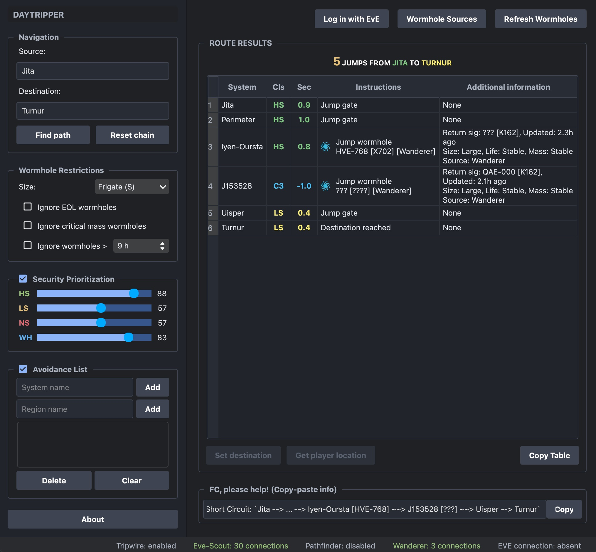

# Short Circuit

[](https://github.com/mogglemoss/shortcircuit/releases)

 **Short Circuit** is an advanced, standalone routing and navigation tool for EVE Online. It calculates the absolute shortest path between solar systems by seamlessly blending standard Stargate routes with live wormhole connections pulled from your favorite 3rd-party mapping tools. 

Whether you're running logistics, hunting targets, or just daytripping in J-Space, Short Circuit takes the guesswork out of traversing New Eden.

## ✨ Features

* **Intelligent Hybrid Routing**: Calculate optimized paths across High Sec, Low Sec, Null Sec, and Wormhole space in seconds.
* **EVE SSO Integration**: Log in securely with your EVE Online account to automatically fetch your current in-game location and set route waypoints directly in the game client.
* **Granular Route Filtering**:
  * **Wormhole Restrictions**: Filter potential paths by ship size (e.g., Frigate, Cruiser), and choose to ignore End of Life (EOL) holes, critical mass holes, or wormholes older than a specified time limit.
  * **Security Prioritization**: Fine-tune your route using custom sliders (0-100) to weight your preference for High Sec, Low Sec, Null Sec, or WH space.
  * **Avoidance List**: Blacklist specific solar systems or entire regions to keep your route out of known gate camps and dangerous space.
* **Fleet-Friendly Exporting**: 
  * Copy your route in a simplified text format perfect for fleet chat (`Jita --> ... --> Iyen-Oursta [HVE-768] ~~> J153528`).
  * Copy the full, detailed instruction table with a single click.

## 📡 Supported Mapping Sources

Short Circuit pulls live chain data directly from the most popular wormhole mapping tools in the EVE community:

* **[Eve-Scout](https://eve-scout.com/)** (Automatic Thera & Turnur connections)
* **[Tripwire](https://tripwire.eve-apps.com/)**
* **[Wanderer](https://wanderer.space/)**

## 🚀 Installation

*(Note: If you provide pre-compiled binaries, you can download the latest version from the [Releases](https://github.com/mogglemoss/shortcircuit/releases) page.)*

**Running from Source:**
Make sure you have Python 3 installed, then clone the repository and install the dependencies:

```bash
git clone [https://github.com/mogglemoss/shortcircuit.git](https://github.com/mogglemoss/shortcircuit.git)
cd shortcircuit
python -m venv .venv
source .venv/bin/activate  # On Windows use: .venv\Scripts\activate
pip install -r requirements.txt
python main.py  # Replace with your actual entry point script if different
